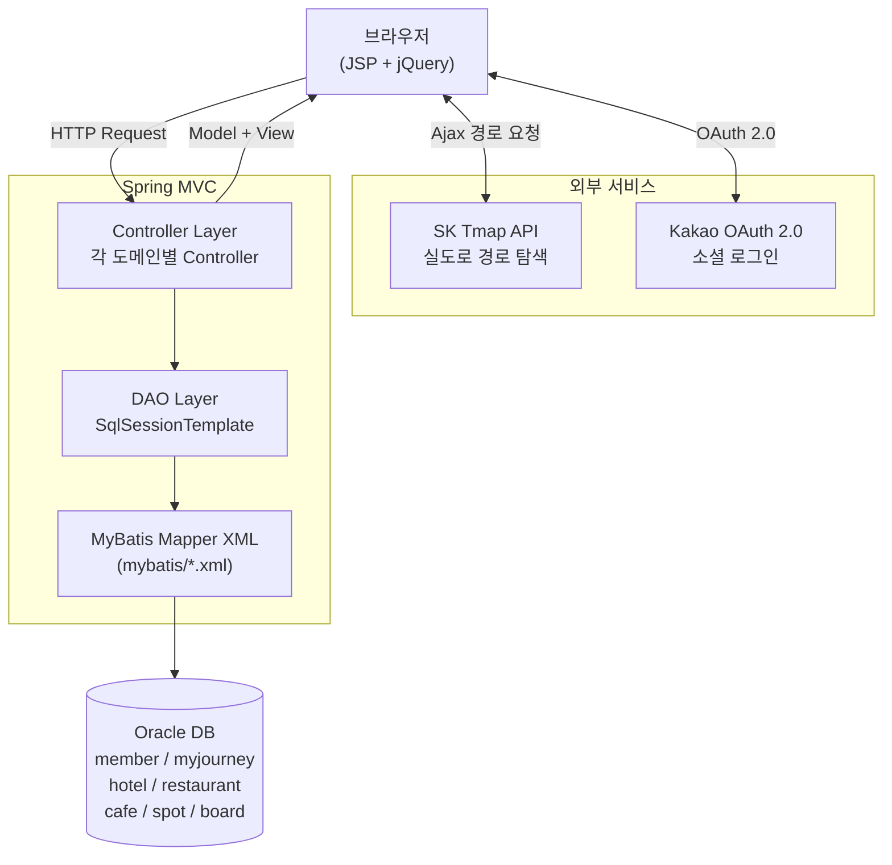
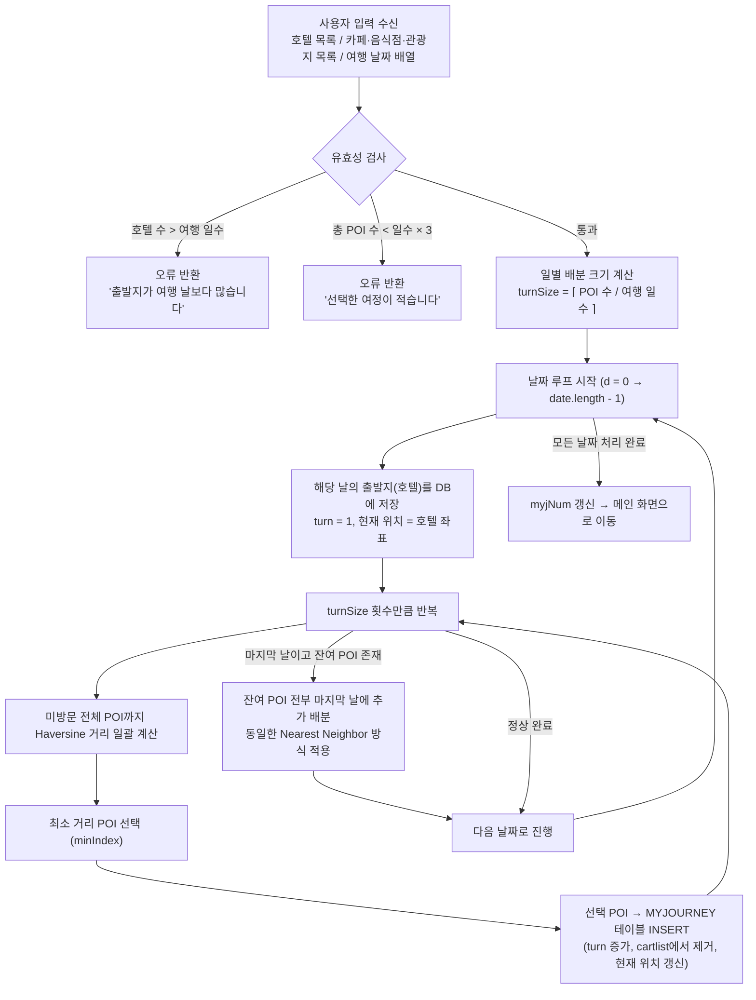

# 🗺️ Trustmefollowme (나만 믿고 따라와)

> 제주도 여행 일정을 자동으로 최적화해주는 Spring MVC 기반 여행 플래닝 웹 애플리케이션


---

## 프로젝트 개요

사용자가 여행 날짜와 방문할 장소(호텔·카페·음식점·관광지)를 선택하면, **Nearest Neighbor Greedy Algorithm**과 **Haversine 거리 공식**을 조합하여 날짜별로 이동거리가 최소화된 최적 동선을 자동 생성하는 팀 프로젝트입니다. 생성된 여정은 SK Tmap API를 통해 실도로 경로로 지도에 시각화됩니다.

> **본인 담당**: 자동 여정 생성 알고리즘 설계 및 구현 (`JourneyController.java`), 여정 관리 기능 전반

---

## 주요 기능

- ✅ **[담당] 자동 여정 생성**: Nearest Neighbor 그리디 알고리즘 + Haversine 공식으로 날짜별 최적 방문 순서 자동 배분
- ✅ **[담당] 수동 여정 빌더**: 사용자가 직접 장소를 날짜에 배치하는 모드
- Kakao OAuth 2.0 소셜 로그인
- 호텔·음식점·카페·관광지 CRUD (이미지 업로드 최대 5장)
- 커뮤니티 게시판 (좋아요, 댓글, 조회수)
- **SK Tmap API** 기반 실도로 경로 시각화 (구간별 거리·소요시간 표시)
- 캘린더 UI로 여행 기간 선택

---

## 기술 스택

| 계층 | 기술 |
|------|------|
| Backend | Java, Spring MVC 3.1.1, MyBatis 3.1.0 |
| Database | Oracle DB, Apache Commons DBCP |
| Frontend | JSP, JSTL, jQuery 3.4.1, Bootstrap 4 |
| External API | SK Tmap API (경로 탐색), Kakao OAuth 2.0 |
| 라이브러리 | Jackson Databind 2.12.5, Lombok 1.18.22, Commons FileUpload |
| Build | Maven, Apache Tomcat |

---

## 시스템 아키텍처



---

## 핵심 기능: 자동 여정 생성 알고리즘

### 개요

여행지 동선 최적화는 본질적으로 **외판원 문제(TSP)**이며, 완전 탐색 시 시간 복잡도가 **O(N!)** 에 달해 실시간 웹 응답에 적합하지 않습니다. 이를 해결하기 위해 **Nearest Neighbor Greedy Algorithm(O(N²))** 을 선택하여, 현재 위치에서 가장 가까운 미방문 장소를 순차적으로 선택하는 방식으로 구현했습니다. 좌표 간 거리 계산에는 위경도(WGS84) 기반 구면 거리를 정확히 계산하는 **Haversine 공식**을 직접 구현했습니다.

---

### 알고리즘 흐름도



---

### Haversine 거리 공식

두 좌표(위도·경도) 사이의 실제 구면 거리를 킬로미터 단위로 계산합니다. `JourneyController.java`의 `Distance()` 메서드에 직접 구현했습니다.

**계산 절차:**

1. 경도 차이: `θ = lon1 - lon2`
2. 구면 거리(라디안):
   ```
   dist = arccos( sin(lat1) · sin(lat2) + cos(lat1) · cos(lat2) · cos(θ) )
   ```
3. km 환산: `라디안 → 도(°) → 해리 × 1.1515 → 마일 × 1.609344 = km`

> Oracle DB에 저장된 좌표가 VARCHAR2 타입이므로 `Double.parseDouble()`로 변환 후 계산하며, 동일 좌표일 경우 즉시 0을 반환하는 엣지 케이스 처리도 포함했습니다.

---

## DB 스키마

### MYJOURNEY 테이블 (자동 여정 저장의 핵심)

| 컬럼 | 타입 | 설명 |
|------|------|------|
| `jnum` | NUMBER | 여정 번호 (최신 여정 = 1, 이전 여정은 +1씩 밀림) |
| `id` | VARCHAR2 | 사용자 이메일 (FK: MEMBER) |
| `xpos` | VARCHAR2 | 위도 (WGS84) |
| `ypos` | VARCHAR2 | 경도 (WGS84) |
| `cate` | VARCHAR2 | 카테고리 (hotel / restaurant / cafe / spot) |
| `ref` | VARCHAR2 | 각 카테고리 테이블의 PK |
| `turn` | NUMBER | 하루 내 방문 순서 (알고리즘이 결정) |
| `jdate` | VARCHAR2 | 여행 날짜 |

### MyBatis 다중 카테고리 조인 패턴

MYJOURNEY 하나로 4개 카테고리(hotel/restaurant/cafe/spot)를 통합 조회하기 위해, `LEFT JOIN + COALESCE` 패턴을 사용해 카테고리에 관계없이 name·address·image를 단일 resultType으로 추출합니다.

```sql
-- mybatis/myjourney.xml 핵심 패턴
SELECT
    COALESCE(s.name, r.name, h.name, c.name) AS name,
    COALESCE(s.address, r.address, h.address, c.address) AS address,
    COALESCE(s.image1, r.image1, h.image1, c.image1) AS image1
FROM myjourney mj
LEFT JOIN spot s ON mj.cate='spot' AND mj.ref=s.snum
LEFT JOIN restaurant r ON mj.cate='restaurant' AND mj.ref=r.rnum
LEFT JOIN hotel h ON mj.cate='hotel' AND mj.ref=h.hnum
LEFT JOIN cafe c ON mj.cate='cafe' AND mj.ref=c.cnum
ORDER BY mj.turn
```

---

## 패키지 구조

```
src/main/java/
├── myjourney/
│   ├── controller/
│   │   ├── JourneyController.java      ← 자동 여정 생성 알고리즘 핵심
│   │   ├── MJDetailController.java     ← 여정 상세 + Tmap 좌표 추출
│   │   └── MJListController.java
│   └── model/
│       ├── MyJourneyBean.java
│       └── MyJourneyDao.java
├── main/
│   ├── controller/
│   │   └── MainController.java         ← 메인 화면, POI 목록 조회
│   └── model/
│       ├── CartBean.java               ← 선택된 POI 임시 저장
│       ├── StartBean.java              ← 현재 위치 추적용
│       └── MainBean.java
├── hotel/ cafe/ restaurant/ spot/      ← 각 POI 도메인 (Controller + Bean + DAO)
├── member/                             ← Kakao OAuth, 회원 관리
├── board/                              ← 커뮤니티 게시판
└── utility/
    └── Paging.java

src/main/java/mybatis/
└── myjourney.xml                       ← COALESCE 다중 조인 쿼리

src/main/webapp/WEB-INF/
├── main/
│   ├── mainCalender.jsp                ← 날짜 선택 캘린더
│   ├── mainTravel.jsp                  ← 자동 모드: 장소 선택
│   └── mainTravel2.jsp                 ← 수동 모드
└── myjourney/
    └── mjdetail.jsp                    ← SK Tmap 경로 렌더링
```

---

## 스크린샷

| 캘린더 & 여행 모드 선택 | 장소 선택 화면 | 자동 여정 결과 (Tmap 경로) |
|:---:|:---:|:---:|
|  |  |  |

> 스크린샷은 `docs/images/` 폴더에 추가해주세요.

---

## 실행 방법

### 사전 요구사항

- JDK 1.6 이상
- Apache Tomcat 7.x
- Oracle DB 11g 이상
- Maven 3.x

### 설정

```bash
# 1. 저장소 클론
git clone https://github.com/haonmik1/travel.git
cd travel/Trustmefollowme

# 2. DB 스키마 및 시드 데이터 삽입
# Oracle SQL Developer 또는 CLI에서 실행
sqlplus user/password@orcl @travel.sql

# 3. DB 접속 정보 수정
# src/main/webapp/WEB-INF/spring/root-context.xml
# → driverClassName, url, username, password 항목 수정

# 4. API 키 설정
# mjdetail.jsp → appKey: "키넣어야함" 부분을 SK Tmap API Key로 교체
# mainTravel.jsp → Kakao Map appkey 교체

# 5. Maven 빌드 및 배포
mvn clean install
# 생성된 WAR 파일을 Tomcat webapps에 배포
```

---

## 기술적 의사결정

### 왜 Nearest Neighbor Greedy를 선택했는가

여행 동선 최적화는 NP-hard인 TSP 문제입니다. 완전 탐색(O(N!))이나 동적 프로그래밍(O(N²·2ᴺ))은 장소 수가 늘어날수록 실시간 웹 응답에 부적합합니다. Nearest Neighbor는 **O(N²)** 으로 수십 개의 장소를 즉각 처리하면서도, 제주도처럼 지역이 한정된 환경에서는 최적해와의 격차가 실용 수준 이내입니다. 향후 개선 방향으로는 **2-opt swap**을 통한 경로 개선이 가능합니다.

### 왜 Haversine 공식을 직접 구현했는가

DB에 저장된 좌표가 위경도(WGS84) 형식이므로, 평면 유클리드 거리를 사용하면 지구 곡률로 인한 오차가 발생합니다. Haversine 공식은 구면 삼각법을 활용해 대권 거리(Great-circle distance)를 계산하며, 외부 라이브러리 없이 Java `Math` 클래스만으로 직접 구현해 의존성을 최소화했습니다.

### jnum 관리 방식

새 여정 저장 시 기존 여정의 `jnum`을 전부 +1씩 올린 뒤(`updateMJList()`), 새 여정을 `jnum=1`로 삽입합니다. 이로써 최신 여정이 항상 `jnum=1`로 조회되어 별도의 정렬 로직 없이 최신 여정을 우선 표시할 수 있습니다.

---

## 개발 기간

2024년 02월 (팀 프로젝트)
